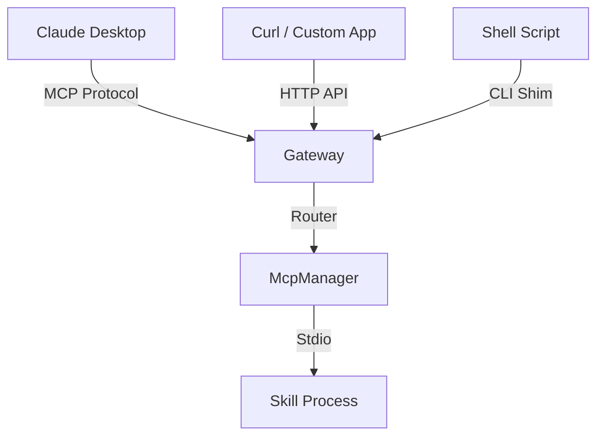

# Design: 本地 MCP 资源中心架构

## Context
我们需要在 PromptStudio (Tauri/Django) 中集成对 MCP (Model Context Protocol) 的完整支持。不仅作为 Client 连接外部 Server，更要作为 Host 管理本地 Server。

## Goals
- **易用性**: 让不懂命令行的用户也能一键启动 "Filesystem MCP" 或 "GitHub MCP"。
- **互通性**: PromptStudio 管理的资源（Prompt 模板、用户脚本）应能通过 MCP 协议暴露给其他 AI 应用（如 Claude Desktop）。
- **轻量级**: 不引入沉重的编排引擎，保持工具属性。

## Decisions

### 1. 统一资源模型 (Unified Resource Model)
- **核心决策**: **Skill (内核) + MCP (外壳)**。
- **Skill**: 用户编写的 Python 函数，关注业务逻辑（如 `def get_stock...`）。
- **MCP Tool**: 系统自动生成的接口定义，关注互操作性（JSON Schema）。
- **实现**: 所有的 Skill 都是一个独立的 MCP Server 进程。
    - **Type A (External)**: 用户配置命令（如 `uvx mcp-server-git`），PromptStudio 负责启动和管道通信。
    - **Type B (Internal/Skill)**: 用户提供源码，PromptStudio 使用内置的 `UniversalWrapper` 启动它，使其表现得像一个标准 MCP Server。

### 2. 通用网关架构 (Universal Gateway)
为了实现“支持几乎所有类型的 CLI”，我们需要一个多协议网关：

- **HTTP Bridge**: 内置 FastAPI/Django 接口 `POST /v1/tools/{name}/call` -> 内部转为 MCP `CallTool` 请求。
- **CLI Shim**: 提供 `ps-run` 命令，将参数解析为 JSON -> 调用 HTTP Bridge。

### 3. Script-to-MCP 转换引擎
- **技术选型**: 使用 `fastmcp` (Python) 或类似库作为底层。
- **工作流**:
    1. 用户在编辑器写 `def calculate(a, b): ...`。
    2. 系统保存为 `skills/my_math.py`。
    3. 系统启动子进程: `python -m prompt_studio.mcp_runner skills/my_math.py`。
    4. `mcp_runner` 解析文件，利用反射生成 MCP Tool Schema，并通过 stdio 暴露服务。

### 5. 作用域与可见性 (Scope & Visibility)
- **Workspace (工作区)**: 引入项目级配置。
    - `Global (~/.promptstudio/mcp_config.json)`: 全局 Skill，对所有项目可见。
    - `Project (./.promptstudio/mcp_config.json)`: 本地 Skill，仅当前项目可见。
- **Merging**: Server 启动时合并 Global + Project 配置。

### 6. 热重载与客户端通知 (Hot-Reload)
- **File Watcher**: 监听 `skills/` 目录和配置文件变更。
- **MCP Notification**: 变更发生时，向所有 Client 发送 `notifications/tools/list_changed`，触发客户端刷新。

### 7. 技能链式调用 (Skill Chaining)
- **Context Injection**: 在 Skill 执行环境中注入 `mcp_client` 对象。
- **Router**: PromptStudio 充当路由，Skill A 调用 `mcp_client.call_tool("skill_b")` -> 路由至 Skill B 进程 -> 返回结果。

### 8. 环境管理 (Environment Management)
- **核心工具**: 集成 `uv` (Astral) 作为包管理器。
- **策略**: **PEP 723 (Inline Script Metadata)**。
    - 用户在脚本头部声明依赖：
      ```python
      # /// script
      # dependencies = ["pandas", "requests"]
      # ///
      ```
    - 系统使用 `uv run script.py` 自动解析并运行，实现**零配置**环境隔离。
- **智能修复**: 捕获 `ModuleNotFoundError`，自动提示一键安装缺失依赖。

### 3. 本地 RAG 实现
- 使用 `chromadb` (嵌入式) 或 `sqlite-vss`。
- 当用户将文件夹标记为“Context Source”时，后台启动索引任务。
- 暴露为 MCP Resource: `mcp://local/docs/{filename}`。

## Risks / Trade-offs
- **环境依赖**: 本地运行 Python/Node MCP Server 需要依赖用户的本地环境。
- **解决**: 尝试打包独立的 Python 环境，或明确提示用户安装依赖。

## Open Questions
- 是否支持通过 SSE (Server-Sent Events) 将 PromptStudio 自身作为一个远程 MCP Server 暴露给局域网内的其他设备？（v2 考虑）。
